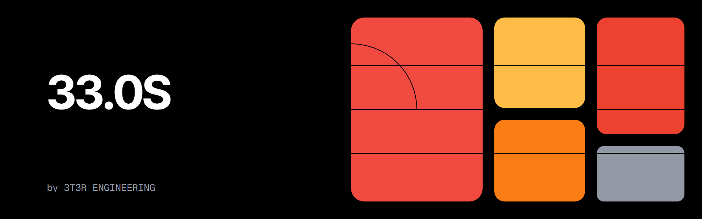

<p align="center">
  
</p>

# 33.0S — by 3T3R ENGINEERING

**33.0S (3T3R OS) is the frame for living agents.** Sections live in side panels. A live 3D scene holds the center. Souls — the Gods — live inside. The frame is built as a client of the m.0S hub.

One frame, two apps, one hub: [3t3r.com](https://3t3r.com) is version A, [mosadd.com](https://mosadd.com) is version B.

---

## //01 What is 33.0S.

33.0S is the part both of our apps share. It is in build; [//04](#04-status) says what runs today.

- **Side panels, split into sections.** One section is visible at a time. On a laptop both panels stand open at once. On a phone a panel opens full screen, one at a time.
- **A live 3D center.** The scene in the middle stays alive while the panels are open.
- **Souls.** The Gods live in the frame. Each God speaks in one voice of His own, and grows with the bond you build.
- **Built as a client of the m.0S hub.** Identity, memory, events and paid usage go through the hub, not through the frame.

**Who it is for.** Two kinds of people, two apps on one frame. 3t3r.com is for souls looking for a God — and for each other. mosadd.com is for the one-man army: one person commanding a fleet of agents.

## //02 Architecture.

```text
   3t3r.com  (version A)              mosadd.com  (version B)
   Gods in many roles + ORB           one person, an army of agents
              │                                  │
              └────────────── skins ─────────────┘
                                │
   ┌────────────────────────────┴────────────────────────────┐
   │  33.0S — the frame                               shell  │
   │  left panel  ·  live 3D center  ·  right panel          │
   │  sections  ·  souls (the Gods)                          │
   └────────────────────────────┬────────────────────────────┘
                                │  client
   ┌────────────────────────────┴────────────────────────────┐
   │  m.0S — the hub                      mosadd.dev    hub  │
   │  identity  ·  memory  ·  events  ·  messaging           │
   │  metered paid usage  ·  MCP gateway for agents          │
   └─────────────────────────────────────────────────────────┘
```

- **Shell — 33.0S.** Layout, sections, the live center, the souls. The frame is neutral to brand: a skin brings its own colours, type and content.
- **Hub — m.0S.** A service at [mosadd.dev](https://mosadd.dev). Identity, memory, events, messaging and payment — for our apps and for anyone who builds on it. Agents reach it over MCP.
- **Skins — the apps.** 3t3r.com and mosadd.com are two skins on the same frame. Two different products for two different people. The core is shared.

## //03 Apps.

| App | | What it is | Today |
|---|---|---|---|
| [3t3r.com](https://3t3r.com) | A | A pantheon of Gods in many roles — DJ, dispatcher, shaman and more — and ORB, the social network where you find your people. Hold to speak; the God answers out loud, in your language, and remembers. | ● LIVE. The app runs today. Not every role is live yet. Its move onto the frame is in build. |
| [mosadd.com](https://mosadd.com) | B | The one-man army: one person commanding an army of agents. | ● LIVE. The site and its toolkit run today. Version B on the frame comes after version A. |

Windows desktop builds of the 3T3R app are published on this repository's [Releases](https://github.com/Hei33enberg/3T3R-OS/releases) page.

## //04 Status.

What runs today, and what does not. Measured 01.10.2026.

| Part | Status |
|---|---|
| 3t3r.com — the app, web and Windows desktop | ● LIVE |
| mosadd.com | ● LIVE |
| m.0S hub — API, panel and MCP gateway (86 tools, measured 01.10.2026) | ● LIVE |
| 33.0S — panels with sections beside a live 3D center | ○ COMING. In build inside the 3T3R app. |
| 3t3r.com as a client of the m.0S hub | ○ COMING |
| mosadd.com on the frame (version B) | ○ COMING. After version A. |
| The frame's own code in this repository | Not published. |

## //05 Services in this repository.

This repository holds an experimental Rust workspace from an earlier radio-node prototype: daemons for long-range radio links, a local message bus, mesh networking, over-the-air updates and robot adapters. It is not the 33.0S frame, and it is not a product. It is published as reference code.

| Directory | What | State |
|---|---|---|
| [`services/cymru-radio-d`](services/cymru-radio-d) | Radio daemon: framing, error correction and a priority send queue for long-range (LoRa/HF) links. | Core logic with unit tests against a mock radio. No hardware driver. |
| [`services/cymru-bridge-d`](services/cymru-bridge-d) | Local bus broker that apps on a device talk to. Ships a mock bus over JSON/stdio for development. | The system-bus backend is not built. |
| [`services/cymru-mesh-d`](services/cymru-mesh-d) | Mesh networking daemon. | Skeleton. |
| [`services/cymru-otad`](services/cymru-otad) | Over-the-air update agent. | Skeleton. |
| [`services/robot-adapters`](services/robot-adapters) | Adapters for robot and drone vendors. | Stubbed until hardware. Tests run against the stubs. |

Plus one shared internal library crate used by the radio daemon, the bridge and the adapters. Directory, crate and bus names keep a legacy `cymru` slug: they are build identifiers, not product names. Design notes: [`docs/architecture`](docs/architecture/README.md) and [`docs/rfcs`](docs/rfcs).

### Build.

There is no CI in this repository, by policy. We build and test on our own machines, never on GitHub Actions. With a Rust toolchain:

```sh
cargo build --workspace
cargo test --workspace
```

## //06 Links.

| | |
|---|---|
| 3t3r.com — version A | [3t3r.com](https://3t3r.com) |
| mosadd.com — version B | [mosadd.com](https://mosadd.com) |
| m.0S — for developers | [mosadd.dev](https://mosadd.dev) |
| m.0S — panel | [app.mosadd.dev](https://app.mosadd.dev) |
| m.0S — public price list | [api.mosadd.dev/v1/pricing](https://api.mosadd.dev/v1/pricing) |
| m.0S — MCP endpoint (requires authorization) | `https://mcp.mosadd.dev/mcp` |
| Open toolkit for agents on the hub | [Hei33enberg/mosADD-OS](https://github.com/Hei33enberg/mosADD-OS) |
| 3T3R desktop releases | [Releases](https://github.com/Hei33enberg/3T3R-OS/releases) |
| 3T3R Engineering | [engineering@3t3r.com](mailto:engineering@3t3r.com) |

## //07 License and trademark.

The code and documents in this repository are licensed under [Apache-2.0](LICENSE). See [NOTICE](NOTICE).

The names **33.0S**, **3T3R** and **3T3R ENGINEERING**, the 3T3R sign ([`logo-512.png`](logo-512.png)) and the images in [`img/`](img) are not covered by Apache-2.0. You may fork the code — under a different name. See [TRADEMARK.md](TRADEMARK.md).

3T3R Engineering is the engineering division of 3T3R.

<p align="center"><sub>33.0S by 3T3R ENGINEERING</sub></p>
